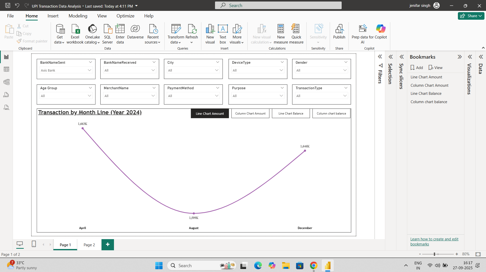
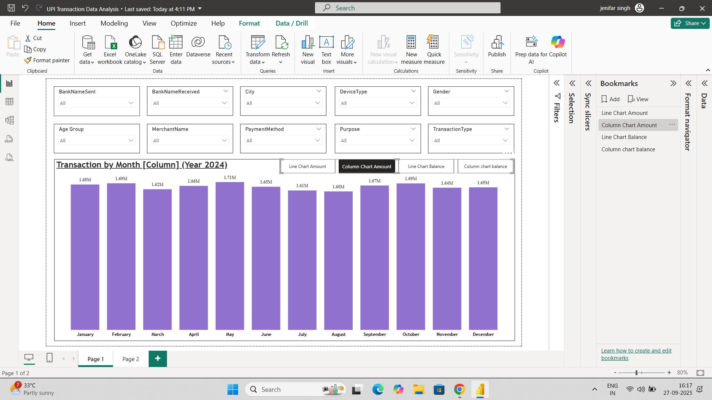
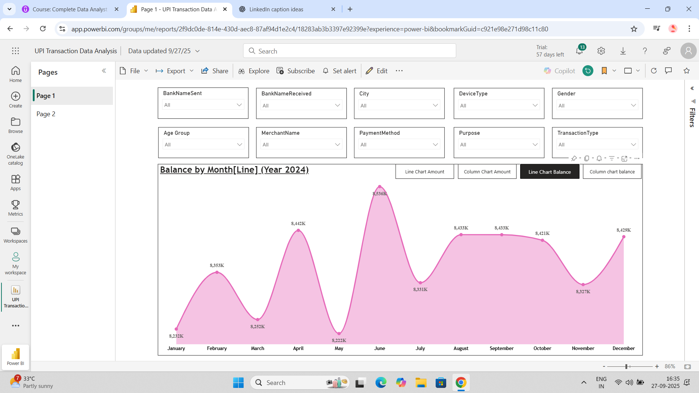
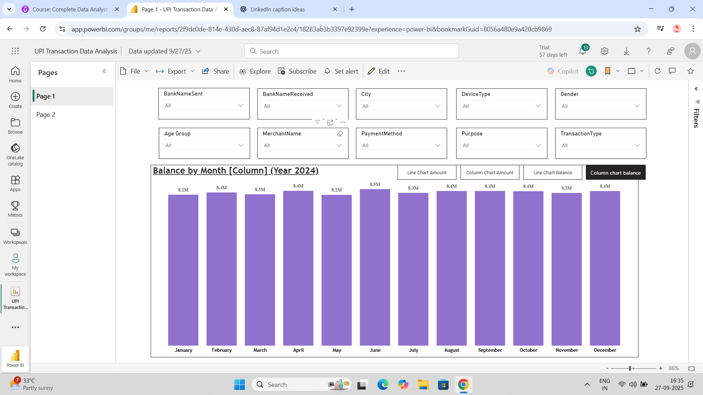

# 📊 UPI Transaction Data Analysis – Power BI Project

## 📌 Project Overview
This project presents an **interactive Power BI dashboard** analyzing **UPI transactions for the year 2024**.  
The goal is to showcase how raw financial data can be transformed into **clear, visual insights** for decision-making.

---

## 🔎 Key Features
- **Interactive Dashboards** with filters for:
  - Bank Name (Sender & Receiver)
  - City
  - Device Type
  - Gender & Age Group
  - Merchant Name
  - Payment Method, Purpose & Transaction Type
- **Visualizations Used**:
  - Line Charts → Monthly transaction & balance trends
  - Column Charts → Month-wise comparisons
  - Tables → City & currency-level breakdown
- **KPIs Tracked**:
  - Total Transactions (Monthly)
  - Balance Variations
  - City-wise Contribution

---

## 📈 Insights Derived
- Transaction volumes **peaked in June 2024**, with steady activity in other months.  
- **August showed the lowest transactions**, but recovery was seen towards December.  
- **City-level analysis** highlights major metros (like Mumbai, Delhi, Bangalore) as key contributors.  

---

## 🛠️ Tools & Technologies
- **Power BI Desktop** → Dashboard design & reporting  
- **Power Query** → Data cleaning & transformation  
- **DAX (Data Analysis Expressions)** → Calculations & measures  

---

## 📷 Dashboard Snapshots

### 1. Transaction by Month (Line Chart)

### 2. Transaction by Month (Column Chart)

### 3. Balance by Month (Line Chart)

### 4. Balance by Month (Column Chart)

---

## 🚀 Learning Outcomes
- Developed skills in **data modeling, DAX, and visualization design**.  
- Gained experience in creating **interactive business intelligence dashboards**.  
- Improved ability to **interpret financial transaction data** effectively.  

---

## 🔗 Future Enhancements
- Predictive analysis for upcoming UPI trends.  
- Real-time data integration.  
- Merchant-level insights for deeper analysis.  

---

## 👤 Author
**Jenifar Singh**  
📅 *2025*  
🔖 #PowerBI #DataAnalytics #DataVisualization #UPI  

---

